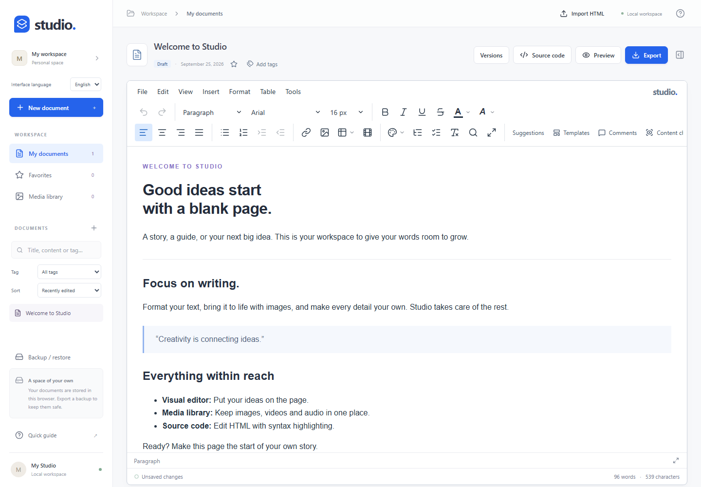

# Studio Editor

**An open-source rich-text editor and local writing workspace, built with Vue 3.**

[Website](https://metinweb.github.io/studio-editor/) · [Live demo](https://metinweb.github.io/studio-editor/demo/) · [Türkçe belge](README.tr.md) · [Vue component API](packages/editor/README.md)



Studio combines a standalone writing app with an embeddable Vue component. The editor engine is implemented in this repository using browser editing primitives; it does not wrap TinyMCE, TipTap, ProseMirror or Lexical. It uses libraries including Vue, Pinia, CodeMirror, DOMPurify and Yjs for other parts of the application.

**Status: beta.** Core editing is covered by Chromium, Firefox and WebKit tests. Collaboration is experimental; see the limitations below before adopting it.

## Features

- Rich text, headings, lists, links, colors, alignment and undo/redo.
- Task lists, mentions, slash commands, Markdown shortcuts and a live heading outline.
- Multi-cell table selection, merged cells, column resizing, sorting and bulk formatting.
- Word/Docs HTML and Excel/Sheets table paste with keep-formatting, clean and plain-text modes.
- Media library with image cropping, rotation, color adjustments and PNG/JPEG/WebP output.
- Comments, replies, selected-text suggestions, templates and basic accessibility checks.
- HTML source editing, sandboxed previews, HTML/DOCX export and browser PDF printing.
- Local documents, favorites, tags, full-text search, persistent versions and workspace backups.
- Vue `v-model`, HTML/JSON APIs, configurable toolbars, plugin commands and media adapters.
- English by default, with a persistent English/Türkçe selector and localized built-in templates.

## Quick start

Use Node.js **22.12+ or 24+**.

```sh
git clone https://github.com/metinweb/studio-editor.git
cd studio-editor
npm ci
npm run dev
```

For a production build:

```sh
npm run build
npm run preview
```

Deploy `dist/` to a static HTTP server. Assets use relative paths, so subdirectory hosting works. Use HTTP or HTTPS rather than opening `index.html` through `file://`.

## Vue component

The source package is under [`packages/editor`](packages/editor). Build it with `npm run build:library`. The package is **not published to npm**; do not assume an npm registry package with the same name belongs to this project.

Create a local installable tarball with `npm run package:release`. See the [package API and integration guide](packages/editor/README.md) and [working Vue example](examples/vue/App.vue) for `v-model`, events, options and adapters. The component's `save` event must be connected to your own persistence layer.

## Languages

The website, standalone workspace and Vue component default to English. Choose **Interface language → Türkçe** in the workspace sidebar to switch; the preference is saved in this browser. Language changes preserve existing document content and undo history. New documents and built-in templates use the selected language.

The [Turkish website](https://metinweb.github.io/studio-editor/tr/) and [Turkish README](README.tr.md) remain available. Component integrations can set `locale="tr"`. See [localization](docs/INTERNATIONALIZATION.md) for translation contributions.

## Data and scope

The standalone app stores documents and media in IndexedDB, in the current browser profile and origin. No account or cloud synchronization is configured by default. Clearing browser data removes local documents; export a full workspace backup first. Remote media may load from external providers.

- Collaboration uses an optional Yjs binding and example server. Concurrent structural editing and live cursors are not production-ready.
- Suggestions apply to selected text; this is not automatic tracking of every change.
- DOCX import and exact Word layout fidelity are not implemented.
- Accessibility checks are basic content checks, not a WCAG compliance certification.
- Real device, mobile keyboard and screen-reader testing remains necessary.

## Development and tests

```sh
npm run test:unit
npx playwright install chromium firefox webkit
npm run build
npm test
```

For package verification, use `npm run package:release` followed by `npm run verify:release`. For the landing page and its demo, use `npm run build:site`, `npm run test:site` and `npm run preview:site`.

GitHub Actions runs unit tests, all three browser projects, library builds and landing-page checks. Successful runs on `main` publish the website and demo to GitHub Pages. Pull requests run checks without deploying.

## Documentation

- [Architecture](docs/ARCHITECTURE.md)
- [Roadmap](docs/ROADMAP.md) and [implementation status](docs/IMPLEMENTATION-PROGRESS.md)
- [Daily writing tools](docs/DAILY-WRITING.md)
- [Document library](docs/DOCUMENT-LIBRARY.md)
- [Tables](docs/TABLES.md) and [clipboard behavior](docs/PASTE.md)
- [Deployment](docs/DEPLOYMENT.md) and [release process](docs/RELEASE.md)
- [Changelog](docs/CHANGELOG.md)

The getting-started guide, component API, contribution guide and localization guide are maintained in English. The detailed architecture and historical implementation notes linked above are currently in Turkish.

## Contributing and security

Read [CONTRIBUTING.md](CONTRIBUTING.md) to get started. Please report vulnerabilities through the private channel in [SECURITY.md](SECURITY.md).

## License

Studio Editor is licensed under the [MIT License](LICENSE), copyright © 2026 metinweb. Third-party dependencies retain their respective licenses. `npm run licenses` generates their license texts and inventory for distributions.
